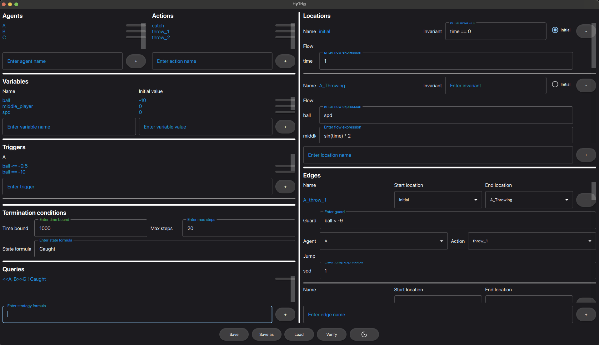
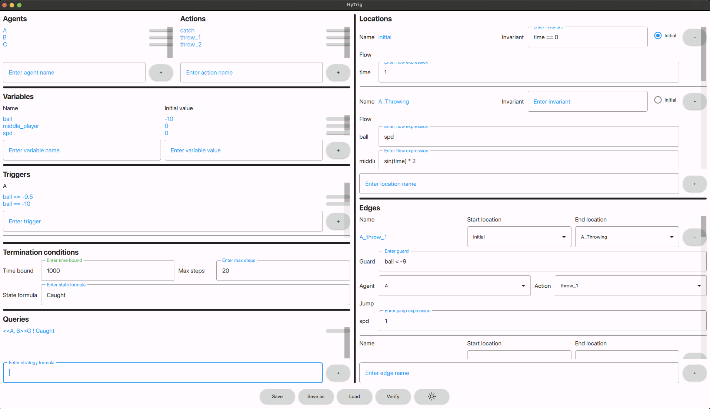

# HyTrig: A Model Checker for Bounded Hybrid Games

**HyTrig** is a high-performance **model checker and simulation tool** designed for the verification and analysis of **bounded hybrid games**.

It provides a practical toolchain for specifying and analyzing hybrid game models against properties expressed in **Alternating Temporal Logic (ATL)** extended with real-valued constraints (Hybrid ATL).

HyTrig implements a novel model checking algorithm for **Hybrid Games with Triggers (HGT)**, which incorporates agents' rationale directly into the model to make the verification of bounded scenarios decidable. 

The tool is implemented in the **Julia** programming language.

-----

## ⚙️ Installation

HyTrig is a Julia-based tool. To get started, you must first install the Julia programming language.

**Install Julia:**
Download and install the latest stable version of Julia from the official website:
[https://julialang.org/downloads/](https://julialang.org/downloads/)

-----

## 🚀 Usage

HyTrig can be run using either a command-line interface (CLI) or a graphical user interface (GUI).

### Command-Line Interface (CLI)

To start the CLI and follow the text-based instructions for specifying models and properties:

```bash
julia hytrig.jl
```

### Graphical User Interface (GUI)

To launch the GUI, which allows users to define the game model, specify Hybrid ATL properties, inspect models, and explore generated game trees:

```bash
julia hytrig_gui.jl
```
 | 

> **Note:** At the moment, the graphical interface (`hytrig_gui.jl`) is **not supported on Windows operating systems**.